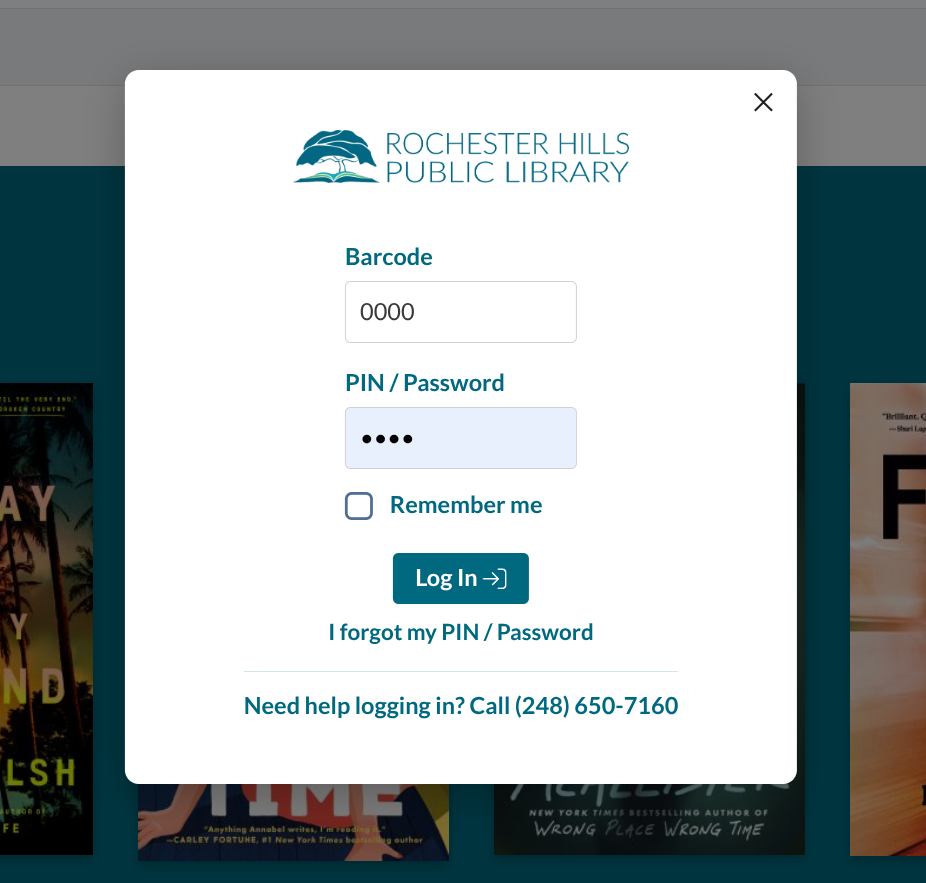

# RHPL Discover

Custom HTML/CSS/JavaScript for the main RHPL Vega Discover catalog.

**Live:** [discover.rhpl.org](https://discover.rhpl.org/) | Vega instance: [rhpl.na3.iiivega.com](https://rhpl.na3.iiivega.com)

This is the full-featured customization for RHPL's public-facing catalog — account portal
tweaks, teal branding, multi-mode search bar (catalog / website / events), and live hours
display. It is the most complete RHPL Vega customization and the best reference for CSS
patterns used across all properties.

---

## Branded Login Modal

In mid-2026 Clarivate replaced the Vega Discover login UI with a bare, unstyled centered
modal — to patrons it read like a third-party popup, not the library. We rebranded it
entirely with **scoped CSS** so it feels like RHPL again:



The standalone, commented CSS is in **[`login-modal.css`](login-modal.css)** (a compacted copy
lives in `Header.html`). Everything is scoped to `[data-automation-id="sign-in-panel"]`, so it
**cannot bleed into any other Vega dialog** (Place Hold, Fines, errors, or the logged-in
account panel). It adds: the RHPL logo, teal field labels + Log In button, a centered card,
and a "Need help logging in?" Circulation line.

### Vega gotchas we hit (read these before adapting)

These cost us a lot of trial and error — they apply to **any** library customizing Vega:

1. **The Custom Header/Footer fields truncate at a length cap.** Code appended at the very
   end of a large field is silently cut off. Keep additions lean (we minify the login block
   in `Header.html`); if a rule "isn't applying," check it isn't past the cutoff.
2. **Footer inline JS: only the first `<script>` reliably runs.** A second/later inline
   script (or one after a long first script) gets dropped. Merge into one block, or don't
   rely on it.
3. **`content: url(data:...)` data-URI backgrounds are not loaded.** Use hosted `https` image
   URLs (the logo works this way).
4. **`content: "text"` in `::before`/`::after` DOES render** — that's how the "Need help…"
   line is drawn (same technique Vega uses for nav chevrons). This is the reliable way to add
   text without JS.
5. **Change wording in Managed Translations, not CSS/JS.** "Passcode" → "PIN / Password" and
   the forgot-link text are set via translation keys (`loginFormPasscode`,
   `loginIForgotMyPasscode`, …) in the patron-interface language file — durable and accessible.
   Because of #1–#3, the help line is plain (non-clickable) text rather than a link.

---

## What It Does

### Header (`Header.html`)

- **Typography**: Lato font (all weights) from Google Fonts
- **Brand color**: RHPL teal `#006980` applied to login button, nav icons, and interactive elements
- **Account portal**: CSS fixes for payment display and portal layout
- **UI cleanup**: Cookie banners, Vega default spacing, and nav chrome suppressed
- **Multi-mode search bar**: Dropdown for catalog / website / events with dynamic placeholder text

### Footer (`Footer.html`)

- **Hours display**: `normalSchedule` (Sunday–Saturday) with `UnavailableDates` overrides
  for holidays and special closures through 2027
- **Search routing**:
  - **Catalog** → `rhpl.na3.iiivega.com/search?query=...`
  - **Website** → `rhpl.org/?s=...`
  - **Events** → `rhpl.org/program-calendar/#/events/?keyword=...`

---

## Customization Notes

### Update brand color (`Header.html`)

Replace `#006980` (RHPL teal) with your library's brand color. It appears in multiple
CSS rules — use Find & Replace.

### Update hours (`Footer.html`)

```js
const normalSchedule = ["Sun hours", "Mon hours", ..., "Sat hours"];

const UnavailableDates = [
    ["MM-DD-YYYY", "H:MMam-H:MMpm"],  // special hours
    ["MM-DD-YYYY", "Closed"],          // closed day
];
```

### Update catalog URL (`Footer.html`)

Replace `rhpl.na3.iiivega.com` with your Vega instance URL.

---

## Dependencies

| Dependency | Source |
|---|---|
| Font Awesome 5.15.4 | [cdnjs.cloudflare.com](https://cdnjs.cloudflare.com/ajax/libs/font-awesome/5.15.4/css/all.min.css) |
| Lato (all weights) | [Google Fonts](https://fonts.google.com/specimen/Lato) |
| Google Analytics | Not included — add your own GA4 tag if needed |
| III Vega platform | Injected into Vega; relies on its DOM structure |
